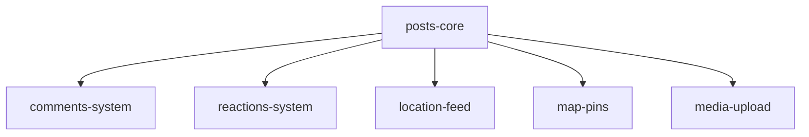

# Parallel Development Guide

This repository is structured for parallel development of 5+ features simultaneously with minimal merge conflicts.

## Quick Start

### 1. Create Your Feature Branch and Worktree

```bash
# Choose your feature from the list below
FEATURE="posts-core"  # or comments-system, reactions-system, etc.

# Create branch and worktree
git checkout -b feature/$FEATURE
git worktree add worktrees/feature-$FEATURE feature/$FEATURE

# Navigate to your worktree
cd worktrees/feature-$FEATURE

# Set up direnv (if using)
echo "source_up" > .envrc
direnv allow
```

### 2. Find Your Files

Each feature has designated stub files ready for implementation:

| Feature | Branch Name | Priority | Key Files |
|---------|-------------|----------|-----------|
| Posts Core | feature/posts-core | Phase 1 (FIRST) | api/internal/services/posts/, api/sql/queries/posts.sql, api/proto/v1/service/posts.proto |
| Comments | feature/comments-system | Phase 2 | api/internal/services/comments/, api/sql/queries/comments.sql, api/proto/v1/service/comments.proto |
| Reactions | feature/reactions-system | Phase 2 | api/internal/services/reactions/, api/sql/queries/reactions.sql, api/proto/v1/service/reactions.proto |
| Location Feed | feature/location-feed | Phase 2 | api/internal/services/feed/, api/sql/queries/feed.sql, api/proto/v1/service/feed.proto |
| Map Pins | feature/map-pins | Phase 2 | api/internal/services/map/, api/sql/queries/map_pins.sql, api/proto/v1/service/map_pins.proto |
| Media Upload | feature/media-upload | Phase 2 | api/internal/services/media/, api/sql/queries/media.sql, api/proto/v1/service/media.proto |

## File Structure Overview

```
alunalun/
├── api/
│   ├── cmd/
│   │   └── server/
│   │       └── main.go         # MERGE POINT: Service initialization
│   ├── internal/
│   │   ├── services/
│   │   │   ├── posts/          # Owner: posts-core
│   │   │   ├── comments/       # Owner: comments-system
│   │   │   ├── reactions/      # Owner: reactions-system
│   │   │   ├── feed/           # Owner: location-feed
│   │   │   ├── map/            # Owner: map-pins
│   │   │   └── media/          # Owner: media-upload
│   │   ├── repository/         # SQLC generated code
│   │   ├── protocgen/          # Protobuf generated code
│   │   └── server/
│   │       ├── server.go       # MERGE POINT: Service registration
│   │       └── routes.go       # MERGE POINT: Route registration
│   ├── proto/
│   │   └── v1/
│   │       ├── entities/       # Shared entity definitions
│   │       └── service/        # Service definitions (one per feature)
│   ├── sql/
│   │   ├── migrations/
│   │   │   └── README.md       # Migration number reservations
│   │   └── queries/
│   │       ├── posts.sql       # Owner: posts-core
│   │       ├── comments.sql    # Owner: comments-system
│   │       ├── reactions.sql   # Owner: reactions-system
│   │       ├── feed.sql        # Owner: location-feed
│   │       └── map_pins.sql    # Owner: map-pins
│   ├── sqlc.yaml               # MERGE POINT: Query file registration
│   ├── buf.yaml                # Protobuf configuration
│   └── buf.gen.yaml            # Protobuf generation config
│
├── web/
│   └── src/
│       ├── app/
│       │   ├── layout.tsx      # MERGE POINT: Provider wrappers
│       │   └── page.tsx        # MERGE POINT: Component mounting
│       ├── features/           # Feature modules (one per feature)
│       └── common/
│           └── clients/        # Service clients (one per feature)
│
├── docs/                       # Development reference documentation
├── Makefile                    # MERGE POINT: Build commands
└── worktrees/                  # Git worktrees for parallel development
```

## Merge Points and Conflict Resolution

### Known Merge Points

These files will have conflicts, but they're designed to be easy to resolve:

1. **api/internal/server/server.go**
   - Look for `[FEATURE-SERVICE-START]` markers
   - Keep all service registrations

2. **api/sqlc.yaml**
   - Keep all query file paths
   - Keep all migration file paths

3. **package.json / go.mod**
   - Keep all dependencies
   - Use latest versions when conflicts occur

4. **web/src/app/layout.tsx**
   - Keep all provider wrappers
   - Maintain nesting order

5. **web/src/app/page.tsx**
   - Keep all component sections
   - Order doesn't matter

### Conflict Resolution Strategy

```bash
# When you encounter a conflict:
git status  # See conflicted files

# For service registration files:
# ALWAYS keep both sides (yours and theirs)
git checkout --theirs api/internal/server/server.go
# Then manually add your section back

# For dependencies:
# Merge and use latest version
git checkout --theirs package.json
# Then re-add your dependencies

# For SQL/Proto files:
# These shouldn't conflict (separate files)
# If they do, you're modifying the wrong file!
```

## Development Workflow

### Phase 1: Posts Core (MUST complete first)

```bash
# Only ONE person works on this
cd worktrees/feature-posts-core

# Implement core tables and services
# Create migrations/004_posts_and_locations.sql
# Implement posts service
# Create proto definitions

# When complete, merge to main
git checkout main
git merge feature/posts-core
```

### Phase 2: Parallel Features (ALL can work simultaneously)

```bash
# Each team works in their worktree
cd worktrees/feature-[your-feature]

# Implement your feature
# Use your reserved migration number
# Stay in your designated files
# Add code between your markers

# When ready to merge
git checkout main
git pull origin main  # Get latest
git merge feature/[your-feature]
```

## Testing Integration

### Local Integration Testing

```bash
# In your worktree, pull in other features for testing
git fetch origin
git merge origin/feature/posts-core  # Required base
git merge origin/feature/comments-system  # Optional: test with comments
git merge origin/feature/reactions-system  # Optional: test with reactions

# Test the integration
make dev
```

### Pre-Merge Checklist

- [ ] Used correct migration number from reservations
- [ ] Only modified files in your ownership
- [ ] Added code between designated markers
- [ ] Tests pass with posts-core merged
- [ ] No modifications to other features' files
- [ ] Documentation updated

## Common Issues and Solutions

### Issue: Migration number conflict
**Solution**: Check `sql/migrations/README.md` for reservations

### Issue: Can't find where to add code
**Solution**: Look for `[FEATURE-START]` markers in integration files

### Issue: Dependency on another feature's types
**Solution**: Only posts-core types are shared. Use interfaces for loose coupling.

### Issue: Tests fail after merge
**Solution**: Ensure posts-core is merged first, then rebuild proto files

## Feature Dependencies



- **posts-core**: No dependencies (base feature)
- **All others**: Depend only on posts-core

## Quick Commands

```bash
# Generate proto files
make proto

# Generate SQLC code
make sqlc

# Run migrations
make migrate

# Start dev servers
make dev

# Run tests
make test

# List worktrees
git worktree list

# Clean up worktree
git worktree remove worktrees/feature-[name]
```

## Team Coordination

### Daily Sync Points
1. Check #dev-parallel channel for updates
2. Announce when merging to main
3. Coordinate on shared types changes

### Merge Schedule
- **Monday**: posts-core freeze (prepare for merge)
- **Tuesday**: posts-core merges to main
- **Wed-Fri**: All Phase 2 features can merge

## Support

- **Slack**: #dev-parallel
- **Issues**: Create with `parallel-dev` label
- **Blocked?**: Check markers and reservations first

---

Remember: The structure is designed for parallel work. If you're getting conflicts, you might be working outside your designated areas!