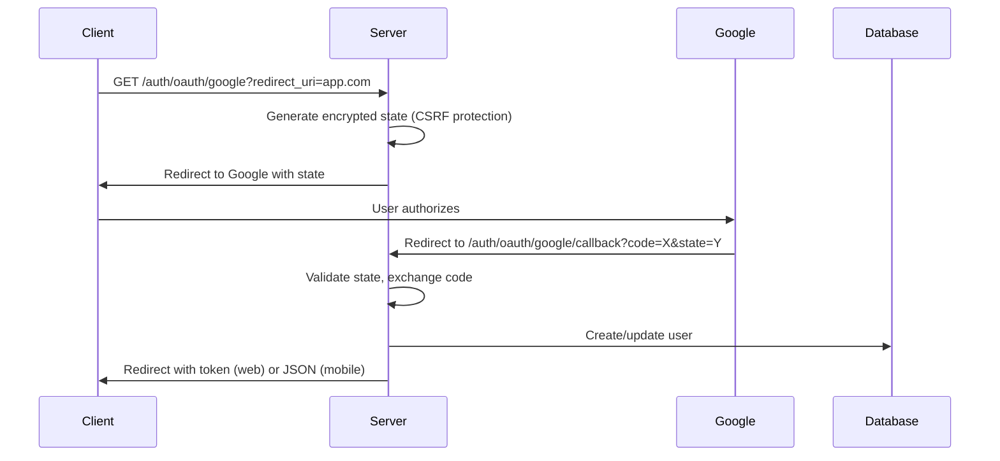

# Authentication Service

A modular, stateless authentication service supporting multiple providers with full server-side OAuth flow.

## Architecture Overview

```
┌─────────────┐     ┌──────────────┐     ┌─────────────┐
│   Client    │────▶│  Auth Service │────▶│  Providers  │
│ (Web/Mobile)│     │   (HTTP/gRPC) │     │(Google/Email)│
└─────────────┘     └──────────────┘     └─────────────┘
                            │
                    ┌───────┴────────┐
                    │                │
                ┌───▼────┐     ┌────▼────┐
                │  Token  │     │ Session │
                │ Manager │     │ Manager │
                └─────────┘     └─────────┘
```

## Core Components

### 1. **Service** (`service.go`)
The orchestrator that implements gRPC/ConnectRPC endpoints:
- `CheckUsername` - Check username availability
- `InitAnonymous` - Create anonymous sessions
- `Authenticate` - Handle authentication (email/password, magic link)
- `RefreshToken` - Refresh expired JWTs

### 2. **OAuth Handler** (`oauth_handler.go`)
HTTP endpoints for full server-side OAuth flow:
- `GET /auth/oauth/{provider}` - Initiate OAuth
- `GET /auth/oauth/{provider}/callback` - Handle OAuth callback
- `POST /auth/refresh` - Refresh expired tokens
- `GET /auth/public-key` - JWT verification key

### 3. **Router** (`router.go`)
Combines HTTP OAuth endpoints with gRPC services into a single server.

## Authentication Flows

### 🔐 Full Server-Side OAuth Flow



**Key Points:**
- Client knows nothing about OAuth - just redirects
- State encrypted with AES-256-GCM (stateless, horizontally scalable)
- Automatic client detection (web gets redirect, mobile gets JSON)

### 🎭 Anonymous Sessions

```go
// Client creates anonymous session
POST /api.v1.service.auth.AuthService/InitAnonymous
{
  "username": "cool_user_123"
}

// Response (token never expires)
{
  "token": "eyJhbGc...",
  "session_id": "abc123",
  "username": "cool_user_123"
}
```

### 📧 Email/Password Authentication

```go
POST /api.v1.service.auth.AuthService/Authenticate
{
  "provider": "email",
  "credential": "{\"email\":\"user@example.com\",\"password\":\"SecurePass123\"}"
}
```

### 🔄 Session Migration

Anonymous users can upgrade to authenticated without losing data:

```go
// Include session_id when initiating OAuth
GET /auth/oauth/google?redirect_uri=app.com&session_id=abc123

// Server migrates anonymous session to authenticated user
```

## Token Management

### JWT Structure
```go
type Claims struct {
    UserID      string  // Authenticated user ID
    SessionID   string  // Session identifier
    Username    string  
    Email       string
    Provider    string  // Auth provider used
    IsAnonymous bool    // Anonymous vs authenticated
}
```

### Token Lifecycle
- **Access Token**: 1 hour expiry
- **Anonymous Token**: Never expires
- **Refresh Window**: 30 days after expiry

### Expired JWT as Refresh Token
No separate refresh tokens - expired JWTs serve as their own refresh tokens:

```go
POST /auth/refresh
{
  "expired_token": "eyJhbGc..." // Expired JWT
}

// Returns new JWT if within 30-day window
{
  "token": "eyJhbGc..." // Fresh JWT
}
```

## Provider System

### Supported Providers

| Provider | Type | Status | Description |
|----------|------|--------|-------------|
| Google | OAuth | ✅ Ready | Full server-side OAuth 2.0 |
| Email | Internal | ✅ Ready | Email/password with bcrypt |
| Anonymous | Internal | ✅ Ready | Session-based anonymous users |
| Magic Link | Internal | 🔧 Partial | Passwordless email (needs email sender) |
| Apple | OAuth | 📋 Planned | Apple Sign In |

### Adding New Providers

1. Implement the `Provider` interface:
```go
type Provider interface {
    Name() string
    Type() string  // "oauth" or "internal"
    Authenticate(ctx, credential) (*UserInfo, error)
    ValidateConfig() error
}
```

2. Register in service initialization:
```go
registry.Register(NewYourProvider(...))
```

## Security Features

### 🛡️ Stateless Design
- **Encrypted State**: OAuth state encrypted with AES-256-GCM
- **No Session Storage**: JWTs are self-contained
- **Horizontal Scaling**: Any server can handle any request

### 🔒 Token Security
- **RSA-256 Signing**: Industry standard JWT signing
- **Short-lived Tokens**: 1-hour expiry for access tokens
- **Secure Refresh**: 30-day window with signature validation

### 🚫 CSRF Protection
- Random nonce in encrypted state
- State validated on callback
- 10-minute state expiry

## Configuration

### Environment Variables
```bash
# OAuth Providers
GOOGLE_CLIENT_ID=your-client-id
GOOGLE_CLIENT_SECRET=your-client-secret
GOOGLE_REDIRECT_URL=http://localhost:8080/auth/oauth/google/callback

# JWT Configuration
JWT_PRIVATE_KEY_PATH=/path/to/private.pem  # RSA private key
JWT_PUBLIC_KEY_PATH=/path/to/public.pem    # RSA public key
JWT_ISSUER=alunalun
JWT_AUDIENCE=web

# State Encryption (32 bytes base64)
OAUTH_STATE_KEY=base64_encoded_32_byte_key

# Server
SERVER_ADDR=:8080
```

### Development Mode
If keys are not provided, the service generates them automatically for development.

## Client Integration

### Web Applications
```javascript
// Start OAuth flow
window.location.href = '/auth/oauth/google?redirect_uri=' + window.location.origin;

// Handle callback (token in URL fragment)
const token = window.location.hash.match(/token=([^&]+)/)?.[1];
if (token) {
    localStorage.setItem('jwt', token);
    window.location.hash = ''; // Clean URL
}
```

### Mobile Applications
```javascript
// Include mobile header
const response = await fetch('/auth/oauth/google/callback?code=' + code, {
    headers: {'X-Client-Type': 'mobile'}
});

// Get JSON response instead of redirect
const {token, user} = await response.json();
```

### gRPC/ConnectRPC Clients
```javascript
// Using Connect for TypeScript
import {createPromiseClient} from "@connectrpc/connect";
import {AuthService} from "./gen/auth_service_connect";

const client = createPromiseClient(AuthService, transport);

// Anonymous session
const {token, sessionId} = await client.initAnonymous({
    username: "user123"
});

// Authenticate
const {token, user} = await client.authenticate({
    provider: "email",
    credential: JSON.stringify({email, password})
});
```

## Testing

### Run Example Server
```bash
go run cmd/auth-example/main.go
```

### Test Endpoints
```bash
# Check OAuth providers
curl http://localhost:8080/auth/oauth/

# Create anonymous session
curl -X POST http://localhost:8080/api.v1.service.auth.AuthService/InitAnonymous \
  -H "Content-Type: application/json" \
  -d '{"username": "test_user"}'

# Get public key
curl http://localhost:8080/auth/public-key
```

## Directory Structure

```
internal/services/auth/
├── service.go         # gRPC service implementation
├── oauth_handler.go   # HTTP OAuth endpoints
├── router.go          # Combined HTTP/gRPC router
└── README.md          # This file

internal/utils/auth/
├── provider.go        # Provider interface
├── token.go           # JWT management
├── session.go         # Session management
├── state.go           # OAuth state encryption
├── context.go         # Context helpers
├── registry.go        # Provider registry
├── config.go          # Configuration structs
├── email_password.go  # Email/password provider
├── magic_link.go      # Magic link provider
└── anonymous.go       # Anonymous provider

internal/utils/oauth/
├── provider.go        # OAuth base provider
└── google.go          # Google OAuth implementation
```

## Key Design Decisions

1. **Full Server-Side OAuth**: Clients only redirect, server handles all OAuth complexity
2. **Stateless Everything**: No Redis/memory storage, encrypted JWTs for state
3. **Expired JWT as Refresh**: No separate refresh tokens, simpler and stateless
4. **Universal Endpoints**: Same OAuth endpoints work for web and mobile
5. **Modular Providers**: Easy to add new authentication methods

## Production Considerations

1. **Replace In-Memory Stores**: Use Redis or database for production
2. **Secure Key Storage**: Use key management service for RSA keys
3. **Rate Limiting**: Add rate limiting to prevent abuse
4. **Monitoring**: Add metrics and logging for auth events
5. **CORS Configuration**: Restrict allowed origins in production

## Support

For issues or questions about the authentication service, check:
- API proto definitions: `/api/proto/v1/service/auth.proto`
- Provider implementations: `/api/internal/utils/auth/`
- Example usage: `/api/cmd/auth-example/main.go`