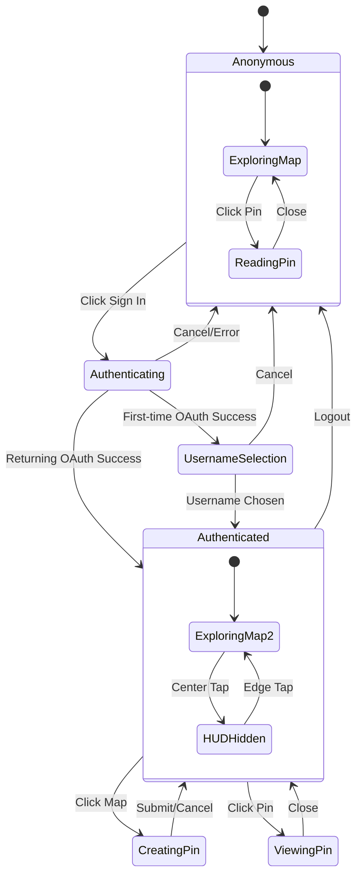

# User Flow State Machine & Journey Maps

## State Machine Definition



## Complete User Journeys

### Journey 1: First-Time User Creates Pin

```
START
  │
  ├─→ Land on map (Anonymous)
  │     └─→ See existing pins
  │
  ├─→ Explore pins (read-only)
  │     └─→ Click pin → Read story → Close
  │
  ├─→ Attempt to create pin
  │     └─→ Click on map → Redirected to sign in
  │
  ├─→ Sign in flow
  │     ├─→ Click ↗ button
  │     ├─→ See login modal
  │     ├─→ Click "Continue with Google"
  │     ├─→ Complete OAuth
  │     └─→ Return to app
  │
  ├─→ Username selection (first-time only)
  │     ├─→ Enter username
  │     ├─→ Real-time validation
  │     └─→ Submit username
  │
  ├─→ Create first pin
  │     ├─→ Click on map
  │     ├─→ See pin indicator at location
  │     ├─→ Enter story in bottom sheet
  │     └─→ Submit pin
  │
  └─→ View created pin
        └─→ Pin appears immediately on map
END
```

### Journey 2: Returning User Quick Pin

```
START
  │
  ├─→ Land on map (Auto-authenticated via stored JWT)
  │     └─→ See username in top-left
  │
  ├─→ Hide HUD for clean view
  │     └─→ Tap center → HUD fades out
  │
  ├─→ Browse map freely
  │     └─→ Pan, zoom, explore
  │
  ├─→ Quick pin creation
  │     ├─→ Tap location on map
  │     ├─→ Type story (auto-focus textarea)
  │     ├─→ Hit Enter or tap "Drop Pin"
  │     └─→ Pin created instantly
  │
  └─→ Continue exploring
END
```

### Journey 3: Mobile User Discovery Flow

```
START
  │
  ├─→ Open on mobile browser
  │     └─→ Full-screen map loads
  │
  ├─→ Grant location permission
  │     ├─→ Tap ◎ locate button
  │     ├─→ Browser permission prompt
  │     └─→ Map centers on location
  │
  ├─→ Browse nearby pins
  │     ├─→ Tap pin marker
  │     ├─→ Bottom sheet slides up (50% height)
  │     └─→ Swipe up for full story
  │
  ├─→ Read multiple stories
  │     ├─→ Swipe down to minimize
  │     ├─→ Tap another pin
  │     └─→ Sheet updates with new content
  │
  └─→ Inspired to contribute
        └─→ Tap ↗ to begin sign in flow
END
```

## Interaction Decision Trees

### Map Tap Decision Tree

```
User taps map
    │
    ├─→ Is user authenticated?
    │     │
    │     ├─→ NO: Show sign-in prompt
    │     │
    │     └─→ YES: Continue...
    │           │
    │           ├─→ Is tap on existing pin?
    │           │     │
    │           │     ├─→ YES: Open pin details
    │           │     │
    │           │     └─→ NO: Continue...
    │           │           │
    │           │           ├─→ Is tap in center zone?
    │           │           │     │
    │           │           │     ├─→ YES & HUD visible: Hide HUD
    │           │           │     ├─→ YES & HUD hidden: No action
    │           │           │     └─→ NO: Continue...
    │           │           │           │
    │           │           │           └─→ Is tap in edge zone?
    │           │           │                 │
    │           │           │                 ├─→ YES & HUD hidden: Show HUD
    │           │           │                 └─→ NO: Start pin creation
    │           │
    │           └─→ Currently creating pin?
    │                 └─→ YES: Cancel creation
```

### Authentication Flow Decision Tree

```
User clicks sign in (↗)
    │
    ├─→ Show OAuth modal
    │     │
    │     ├─→ User selects Google
    │     │     │
    │     │     ├─→ Turnstile verification
    │     │     │     │
    │     │     │     ├─→ PASS: Redirect to Google
    │     │     │     └─→ FAIL: Show error
    │     │     │
    │     │     └─→ Google OAuth flow
    │     │           │
    │     │           ├─→ User approves
    │     │           │     │
    │     │           │     ├─→ Has username?
    │     │           │     │     │
    │     │           │     │     ├─→ YES: Complete login
    │     │           │     │     └─→ NO: Show username picker
    │     │           │     │
    │     │           │     └─→ Username picker
    │     │           │           │
    │     │           │           ├─→ Valid username entered
    │     │           │           │     └─→ Save & complete
    │     │           │           │
    │     │           │           └─→ Cancel
    │     │           │                 └─→ Logout & return
    │     │           │
    │     │           └─→ User cancels
    │     │                 └─→ Close modal
    │     │
    │     └─→ User presses ESC
    │           └─→ Close modal
```

## State Transitions Table

| Current State | Trigger | Condition | Next State | Side Effects |
|--------------|---------|-----------|------------|--------------|
| Anonymous | Click ↗ | - | Authenticating | Show OAuth modal |
| Anonymous | Click pin | - | ViewingPin (RO) | Show pin details |
| Anonymous | Click map | - | PromptAuth | Show "Sign in to create" |
| Authenticating | OAuth success | New user | UsernameSelection | Show username form |
| Authenticating | OAuth success | Existing user | Authenticated | Load user data |
| Authenticating | Cancel/ESC | - | Anonymous | Close modal |
| UsernameSelection | Submit | Valid username | Authenticated | Save username |
| UsernameSelection | Cancel | - | Anonymous | Logout, close modal |
| Authenticated | Click map | Empty location | CreatingPin | Show creation form |
| Authenticated | Click map | Has pin | ViewingPin | Show pin details |
| Authenticated | Tap center | HUD visible | HUDHidden | Fade out controls |
| HUDHidden | Tap edge | - | Authenticated | Fade in controls |
| CreatingPin | Submit | Valid content | Authenticated | Create pin, close form |
| CreatingPin | Cancel/ESC | - | Authenticated | Close form |
| ViewingPin | Close/ESC | - | Authenticated | Close details |
| Authenticated | Click J button | - | UserMenu | Show mini menu |
| UserMenu | Click Logout | - | Anonymous | Clear session |

## Mobile-Specific Flows

### Bottom Sheet States

```
COLLAPSED (10% height)
    │ Swipe up or tap
    ├─→ PEEK (50% height)
    │     │ Swipe up
    │     ├─→ EXPANDED (90% height)
    │     │     │ Swipe down
    │     │     └─→ PEEK
    │     │ Swipe down
    │     └─→ COLLAPSED
    │ Tap outside
    └─→ CLOSED
```

### Mobile Gesture Flows

```
PINCH GESTURE
    ├─→ Outward: Zoom in
    └─→ Inward: Zoom out

PAN GESTURE
    └─→ Any direction: Move map

TAP GESTURE
    ├─→ Single tap
    │     ├─→ On pin: Open details
    │     ├─→ On empty: Create pin (if auth)
    │     └─→ On control: Activate control
    └─→ Double tap
          └─→ Zoom in at location

SWIPE GESTURE (on bottom sheet)
    ├─→ Up: Expand sheet
    ├─→ Down: Collapse sheet
    └─→ Down from collapsed: Close sheet
```

## Error Recovery Flows

### Network Error Recovery

```
Action fails (network error)
    │
    ├─→ Optimistic update reverted
    ├─→ Show error toast (3s)
    └─→ User can:
          ├─→ Retry action
          ├─→ Cancel and try later
          └─→ Check connection
```

### Authentication Error Recovery

```
OAuth fails
    │
    ├─→ Token expired
    │     └─→ Silent refresh
    │           ├─→ Success: Continue action
    │           └─→ Fail: Show login
    │
    ├─→ Network error
    │     └─→ Show "Check connection"
    │
    └─→ User cancelled
          └─→ Return to previous state
```

### Validation Error Recovery

```
Username validation fails
    │
    ├─→ Already taken
    │     └─→ Suggest alternatives
    │
    ├─→ Invalid characters
    │     └─→ Show requirements
    │
    └─→ Too short/long
          └─→ Show character count
```

## Performance State Transitions

### Optimistic Updates

```
User creates pin
    │
    ├─→ Immediately show pin on map (optimistic)
    ├─→ Send API request in background
    │     │
    │     ├─→ Success
    │     │     └─→ Replace temp pin with real pin
    │     │
    │     └─→ Failure
    │           ├─→ Remove temp pin
    │           ├─→ Show error message
    │           └─→ Preserve user's content for retry
```

### Progressive Loading

```
Map initialization
    │
    ├─→ Load map tiles (priority 1)
    ├─→ Load nearby pins (priority 2)
    ├─→ Load user location (priority 3)
    └─→ Preload common UI components (priority 4)
```

## Analytics Events

Track these key flow points:

```typescript
// Critical funnel events
track('land_anonymous')
track('sign_in_initiated')
track('oauth_completed')
track('username_selected')
track('first_pin_created')

// Engagement events
track('hud_toggled', { hidden: boolean })
track('pin_viewed', { pinId: string })
track('pin_created', { location: coords })
track('location_requested')

// Error events
track('auth_error', { type: string })
track('pin_creation_failed', { reason: string })
track('network_error', { endpoint: string })
```

## Testing Scenarios

### Critical User Paths to Test

1. **Anonymous → First Pin**
   - Land → Sign in → Username → Create pin → View pin

2. **Return User Quick Pin**
   - Land (auto-auth) → Click map → Create → Submit

3. **Mobile Discovery**
   - Land → Browse → Read pin → Sign in → Create

4. **HUD Toggle Flow**
   - Show HUD → Hide (center tap) → Show (edge tap)

5. **Error Recovery**
   - Network fail → Retry → Success

### Edge Cases to Handle

- Double-tap prevention on submit buttons
- Race conditions in username validation
- OAuth popup blockers
- Expired JWT refresh
- Location permission denied
- Offline pin creation queue
- Multiple tab synchronization
- Deep linking to specific pins
- Back button behavior
- PWA installation flow

---

This state machine and flow documentation provides a complete behavioral specification for the Alunalun minimal UI implementation.